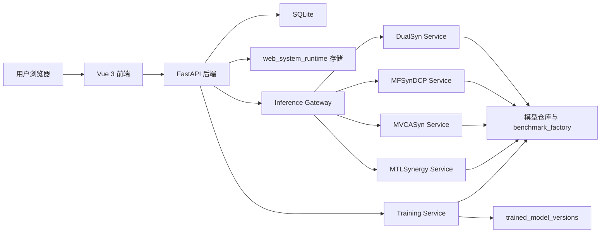

# 系统架构设计说明

## 1. 设计目标

本架构说明用于明确当前药物协同预测平台的原生 Web 架构边界。系统以 `web_system_frontend/`、`web_system_backend/` 和 `web_system_runtime/` 为核心，目标是：

1. 建立统一的 Web 系统入口。
2. 将推理与训练执行能力统一纳入运行时层管理。
3. 通过后端实现任务编排、状态汇总和下载封装。
4. 保持前后端与运行时边界清晰，便于部署与维护。

## 2. 总体架构



### 2.1 架构说明

1. 前端负责界面、表单、轮询、任务查看与结果展示。
2. 后端负责资源建模、状态标准化、路径桥接、文件下载和健康汇总。
3. 推理网关负责接收标准化推理请求，并向四个模型服务分发执行。
4. 训练服务负责接收训练请求、执行训练链路并产生版本目录。
5. `web_system_runtime/` 是所有运行时输出、上传包、训练版本和训练数据包的统一根目录。

## 3. 分层设计

### 3.1 表现层

表现层由 `web_system_frontend/` 构成，主要职责如下：

1. 页面路由与布局。
2. 表单输入与用户提示。
3. 轮询任务状态。
4. 展示结果预览、日志和版本信息。

### 3.2 业务层

业务层由 `web_system_backend/` 构成，主要职责如下：

1. 提供 `/api` 下的统一 REST 接口。
2. 管理 SQLite 中的数据集与任务元数据。
3. 统一远端任务状态为本地状态集合。
4. 负责宿主机、容器、WSL 三种路径之间的转换。
5. 对外提供下载入口和健康检查入口。

### 3.3 运行时层

运行时层由 `web_system_runtime/` 和相关服务构成，主要职责如下：

1. 提供推理网关。
2. 提供四个模型推理服务包装层。
3. 提供训练服务入口。
4. 保存运行时上传包、推理结果、训练产物和模型版本。

### 3.4 存储层

存储层分为两类：

1. 元数据存储：
   `web_system_backend/data/web_system.db`
2. 文件型运行时存储：
   `web_system_runtime/user_bundles/web_system_uploads/`
   `web_system_runtime/outputs/web_system_bridge/`
   `web_system_runtime/trained_model_versions/`
   `web_system_runtime/training_bundles/`

## 4. 组件关系

### 4.1 前端与后端

前端统一通过 `/api` 调用后端，不直接访问模型服务，也不直接访问运行时目录。这样可以保证：

1. 前端页面不依赖本地磁盘结构。
2. 所有下载和状态查询都经过后端校验。
3. 后续替换存储或运行时实现时，前端改动最小。

### 4.2 后端与推理运行时

后端通过 `WEB_SYSTEM_GATEWAY_URL` 调用推理网关，通过 `WEB_SYSTEM_GATEWAY_RUNTIME_ROOT` 将宿主机路径映射为网关容器可识别路径。核心动作包括：

1. 将样本 CSV 路径转换为网关挂载路径。
2. 调用 `/runs` 创建推理任务。
3. 调用 `/runs/{id}` 查询详情。
4. 调用 `/runs/{id}/cancel` 取消任务。

### 4.3 后端与训练服务

后端通过 `WEB_SYSTEM_TRAINING_URL` 调用训练服务，并将 Windows 路径转换为 WSL 路径。核心动作包括：

1. 校验训练所需文件是否齐全。
2. 调用 `/training-runs` 创建训练任务。
3. 调用 `/training-runs/{id}` 刷新状态。
4. 调用 `/model-versions` 读取版本信息。

## 5. 运行拓扑

### 5.1 Web 层

Web 层由 `docker-compose.web.yml` 管理，包含：

1. `web-backend`
2. `web-frontend`

其中：

1. 前端容器对外暴露 `5173`
2. 后端容器对外暴露 `9000`

### 5.2 推理运行时层

推理运行时层由 `web_system_runtime/docker-compose.yml` 管理，包含：

1. `gateway`
2. `dualsyn-service`
3. `mfsyndcp-service`
4. `mvcasyn-service`
5. `mtlsynergy-service`

其中网关对外暴露 `8000`。

### 5.3 训练服务

当前训练服务通过以下脚本在 WSL 中启动：

```powershell
powershell -ExecutionPolicy Bypass -File .\scripts\start_web_system.ps1 -StartTrainingService
```

## 6. 关键配置

| 配置项 | 含义 |
| --- | --- |
| `WEB_SYSTEM_RUNTIME_ROOT` | 运行时根目录 |
| `WEB_SYSTEM_WORKSPACE_ROOT` | 工作区根目录 |
| `WEB_SYSTEM_GATEWAY_URL` | 推理网关地址 |
| `WEB_SYSTEM_TRAINING_URL` | 训练服务地址 |
| `WEB_SYSTEM_GATEWAY_RUNTIME_ROOT` | 网关容器中的运行时挂载根目录 |
| `WEB_SYSTEM_DATABASE_URL` | 后端数据库连接串 |

## 7. 架构结论

当前系统的核心架构结论如下：

1. Web 系统已形成统一入口。
2. 前后端职责清晰，运行时边界明确。
3. 推理与训练通过后端统一编排，但运行形态可以不同。
4. 活动部署围绕原生 Web 工程展开。
