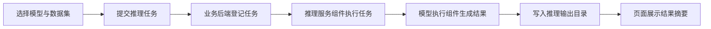
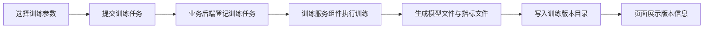

# 答辩支撑材料

## 1. 答辩核心口径

答辩时建议始终围绕以下主线展开：

1. 本课题不是提出新模型，而是将四个已有模型整理为统一系统。
2. 本系统的工程重点是统一数据包、统一任务编排、统一结果展示和统一版本管理。
3. 本系统已经形成完整的软件结构，能够支撑页面展示、任务运行、结果查看和版本沉淀。
4. 训练长时执行在当前设备环境下受到限制，但训练链路的软件设计完整。

## 2. 三句话概括系统

1. 本系统面向药物组合协同预测场景，统一承载 `DualSyn`、`MFSynDCP`、`MVCASyn`、`MTLSynergy` 四个模型。
2. 系统围绕数据集、任务、结果和版本构建统一的软件流程，而不是分别维护四套离散工具。
3. 系统最终输出的不只是预测结果，也包括可追溯的任务记录、版本信息和工程文档。

## 3. 答辩亮点

### 3.1 工程整合亮点

1. 四模型统一纳入同一系统框架。
2. 统一数据包降低输入差异带来的复杂度。
3. 统一任务界面提升操作一致性。
4. 统一版本目录增强实验结果可追溯性。

### 3.2 软件工程亮点

1. 架构分层清晰。
2. 页面、接口、目录和版本形成闭环。
3. 文档体系完整，适合论文与交付复用。

## 4. 可直接用于 PPT 的流程图

### 4.1 推理流程图

### 4.2 训练流程图

## 5. 常见答辩问题及建议回答

### 5.1 论文主线是什么

建议回答：

“本课题的重点不是提出新的预测模型，而是将四个已有模型整合进统一的软件系统，使模型能力能够以工程化方式组织、展示和复用。”

### 5.2 系统的主要创新点是什么

建议回答：

“创新点主要体现在统一数据包设计、统一任务编排、统一版本管理和统一结果展示，这些工作把分散的研究模型转化成可交付的软件系统。”

### 5.3 训练为什么没有做长时展示

建议回答：

“训练链路已经在系统层面完整设计，包括任务入口、参数组织、版本目录和产物归档；受当前设备环境、依赖条件和执行时长影响，本次展示主要以结构完整性和轻量验证为主。”

## 6. 答辩页建议

1. 课题背景与目标。
2. 四模型统一系统定位。
3. 总体架构图。
4. 推理流程图。
5. 训练流程图。
6. 页面截图与结果展示。
7. 测试与限制说明。
8. 总结与展望。

## 7. 结论性表述

答辩收尾时可直接使用：

“本课题完成了四个药物组合协同预测模型的软件系统化整理，形成了统一的数据、任务、结果和版本管理机制，为模型实验、论文撰写和成果展示提供了稳定的工程支撑。”
