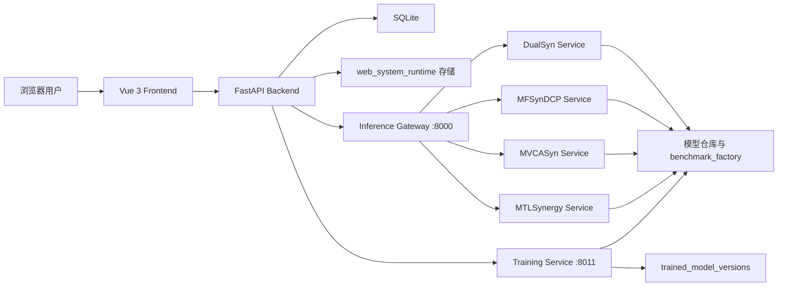
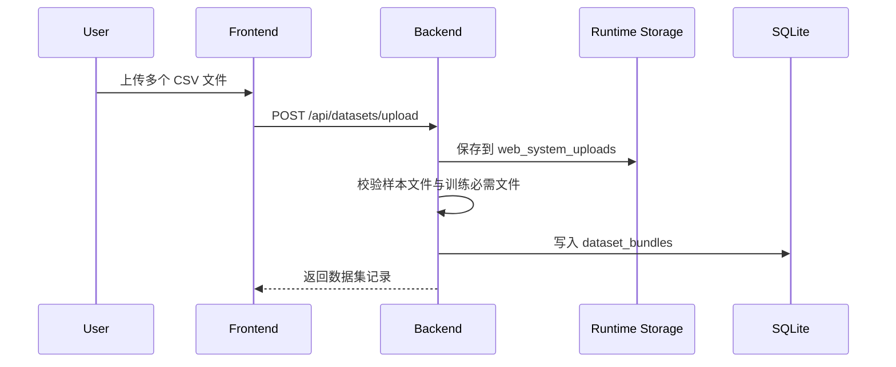
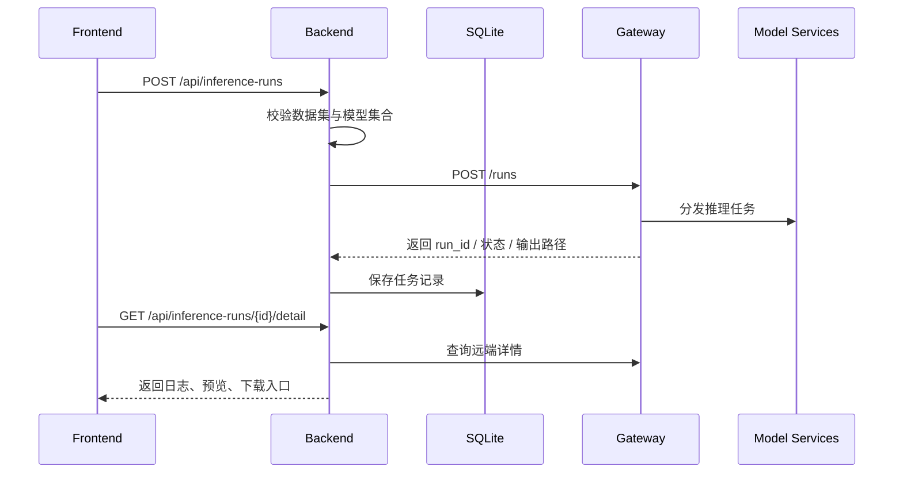
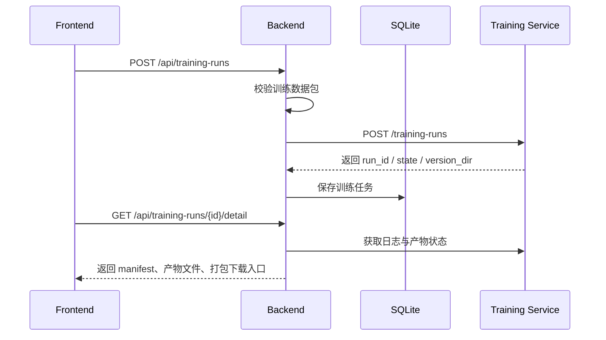

# 药物协同预测 Web 系统项目设计书

| 项目名称 | 药物协同预测 Web 系统 |
| --- | --- |
| 文档类型 | 项目设计书 / 系统设计说明 |
| 当前版本 | V1.2 |
| 更新日期 | 2026-05-01 |
| 适用范围 | 毕业设计、系统交付、部署说明、答辩材料 |
| 当前生效目录 | `web_system_frontend/`、`web_system_backend/`、`web_system_runtime/` |

## 1. 项目概述

### 1.1 建设背景

本项目面向药物组合协同效应预测场景，目标是在保留四个既有模型能力的基础上，建设一套可直接演示、可持续维护、可独立运行的原生 Web 系统。系统当前统一整合的模型包括：

1. `DualSyn`
2. `MFSynDCP`
3. `MVCASyn`
4. `MTLSynergy`

现役架构由以下三部分组成：

1. `web_system_frontend/`：Vue 3 前端，负责页面展示与交互。
2. `web_system_backend/`：FastAPI 后端，负责数据持久化、任务编排、文件下载与运行时桥接。
3. `web_system_runtime/`：原生 Web 运行时目录，承载推理网关、模型服务包装层、训练服务入口、运行时存储与模型版本资产。

### 1.2 建设目标

系统建设目标如下：

1. 形成完整的前后端分离 Web 系统。
2. 提供统一的数据集管理、推理任务管理、训练任务管理和模型版本展示能力。
3. 通过 SQLite 持久化系统元数据，保证刷新页面后任务和数据集记录仍可追踪。
4. 通过标准化后端接口屏蔽模型服务差异，统一管理推理、训练、下载与日志查看流程。
5. 将推理网关、模型服务和训练服务纳入 `web_system_runtime` 运行时边界。
6. 支持本地开发启动、容器化启动与答辩演示场景下的一键检查。

### 1.3 用户角色

| 用户角色 | 主要目标 | 典型操作 |
| --- | --- | --- |
| 演示用户 | 快速查看系统能力 | 查看概览、提交推理、查看结果 |
| 研究人员 | 管理实验数据与结果 | 上传数据集、运行推理、下载结果 |
| 模型维护人员 | 管理训练任务与版本资产 | 提交训练、查看日志、下载产物、查看版本 |
| 系统维护人员 | 启停服务与排查问题 | 启动脚本、检查健康状态、查看日志、核对端口 |

## 2. 系统范围与边界

### 2.1 系统内部组成

系统内部包含以下对象：

1. Web 前端界面与路由。
2. FastAPI 后端接口与数据库。
3. 运行时存储目录：
   `web_system_runtime/user_bundles/web_system_uploads/`
   `web_system_runtime/outputs/web_system_bridge/`
   `web_system_runtime/trained_model_versions/`
   `web_system_runtime/training_bundles/`
4. 推理网关与四个模型推理服务。
5. WSL 训练服务及其版本产物。

### 2.2 系统外部依赖

系统外部依赖主要包括：

1. `benchmark_factory/`
2. `DualSyn/`
3. `MFSynDCP/`
4. `MVCASyn/`
5. `MTLSynergy/`

这些目录承载模型脚本、环境说明和运行依赖，但当前 Web 系统的业务入口、状态持久化和交互流程均由前后端工程统一管理。

### 2.3 不在当前范围内的能力

当前版本不包含以下企业化能力：

1. 用户登录与权限控制。
2. 多用户并发隔离。
3. 分布式任务队列。
4. 云端对象存储与生产级数据库。
5. 在线协同标注与多人实验编排。

## 3. 总体架构设计

### 3.1 架构风格

系统采用“前端展示层 + 后端业务层 + 独立运行时层”的三层结构：

1. 前端负责页面、表单、轮询与结果展示。
2. 后端负责资源建模、任务登记、健康汇总、路径转换与下载封装。
3. 运行时层负责推理与训练的实际执行。



### 3.2 部署拓扑

当前活动部署拆分为两套：

1. Web 层：
   `docker-compose.web.yml`
   负责 `web-frontend` 与 `web-backend`
2. 推理运行时层：
   `web_system_runtime/docker-compose.yml`
   负责 `gateway` 与四个模型服务
3. 训练服务：
   通过 `scripts/start_web_system.ps1 -StartTrainingService` 在 WSL 中启动 `service_runtime.training_service:app`

## 4. 核心目录设计

| 目录 | 责任 |
| --- | --- |
| `web_system_frontend/` | 前端页面、组件、状态管理、API 调用层 |
| `web_system_backend/` | 后端接口、服务层、数据库、下载封装 |
| `web_system_runtime/` | 推理网关、模型服务包装、训练服务入口、运行时存储 |
| `scripts/` | 启动、容器化启动、健康检查脚本 |
| `docs/project_docs/` | 设计、接口、部署、维护文档 |

## 5. 功能设计

### 5.1 系统概览

系统概览页展示以下信息：

1. 数据集数量。
2. 推理任务数量。
3. 训练任务数量。
4. 运行中任务数量。
5. 模型版本数量。
6. 推理网关健康状态。
7. 训练服务健康状态。
8. 主机资源快照。

### 5.2 数据集管理

数据集模块支持：

1. 上传一个或多个 CSV 文件组成的数据包。
2. 自动清理文件名并保存到 `web_system_runtime/user_bundles/web_system_uploads/`。
3. 自动识别样本文件、样本数量、文件列表和校验结果。
4. 基于文件结构判断数据集是否支持推理、训练或二者兼具。
5. 预览样本文件前若干行内容。

### 5.3 推理工作台

推理模块支持：

1. 选择数据集。
2. 选择模型集合。
3. 选择模型版本 `model_version_id`。
4. 创建推理任务并写入本地任务表。
5. 通过后端轮询运行时状态。
6. 查看推理日志、结果预览与下载入口。

### 5.4 训练中心

训练模块支持：

1. 选择训练数据集。
2. 选择模型集合。
3. 配置 `profile`、`device`、`epochs`、`label_threshold`、`version_note`。
4. 创建训练任务并持久化。
5. 查看任务状态、完整日志、产物目录和压缩下载入口。
6. 将训练输出纳入模型版本展示链路。

### 5.5 模型版本中心

模型版本模块支持：

1. 从训练服务读取 `/model-versions`。
2. 展示版本编号、创建时间、模型集合、训练档位与备注。
3. 将训练产物组织为可查询的版本记录。

### 5.6 任务详情工作台

任务详情统一展示：

1. 本地任务状态与远端状态。
2. 所属数据集信息。
3. 运行日志。
4. 推理结果 CSV 预览。
5. 训练产物文件列表。
6. `manifest`、`service_outputs`、`resource_reports` 等结构化信息。

## 6. 数据与任务模型设计

### 6.1 数据集对象

数据集记录由后端持久化，核心字段包括：

1. `id`
2. `name`
3. `bundle_path`
4. `sample_file`
5. `source_type`
6. `description`
7. `is_ready`
8. `sample_count`
9. `files`
10. `validation_detail`
11. `bundle_kind`
12. `supports_inference`
13. `supports_training`

### 6.2 任务对象

推理任务与训练任务统一建模，核心字段包括：

1. `task_type`
2. `title`
3. `local_status`
4. `remote_state`
5. `remote_run_id`
6. `dataset_id`
7. `model_version_id`
8. `selected_models`
9. `output_path`
10. `log_excerpt`
11. `error_message`
12. `summary`

### 6.3 状态标准化

后端将远端状态统一收敛到以下集合：

1. `waiting`
2. `running`
3. `completed`
4. `failed`
5. `canceling`
6. `canceled`

同时统一处理远端别名：

1. `queued`、`pending` -> `waiting`
2. `success` -> `completed`
3. `error` -> `failed`
4. `cancelled` -> `canceled`

## 7. 关键业务流程

### 7.1 数据集上传流程



### 7.2 推理流程



### 7.3 训练流程



## 8. 部署与运行设计

### 8.1 关键端口

| 服务 | 地址 |
| --- | --- |
| 前端 | `http://127.0.0.1:5173` |
| 后端健康检查 | `http://127.0.0.1:9000/health` |
| 系统概览接口 | `http://127.0.0.1:9000/api/system/summary` |
| 推理网关健康检查 | `http://127.0.0.1:8000/health` |
| 训练服务健康检查 | `http://127.0.0.1:8011/health` |

### 8.2 启动方式

推荐按以下顺序启动：

1. 首次构建推理运行时：
   `docker compose -f .\web_system_runtime\docker-compose.yml up -d --build`
2. 启动本地 Web 系统：
   `powershell -ExecutionPolicy Bypass -File .\scripts\start_web_system.ps1`
3. 如需训练服务：
   `powershell -ExecutionPolicy Bypass -File .\scripts\start_web_system.ps1 -StartTrainingService`
4. 如需直接启动容器化 Web 层：
   `powershell -ExecutionPolicy Bypass -File .\scripts\start_web_system_docker.ps1`

### 8.3 环境变量

| 变量名 | 作用 |
| --- | --- |
| `WEB_SYSTEM_DATABASE_URL` | 后端 SQLite 连接串 |
| `WEB_SYSTEM_RUNTIME_ROOT` | 运行时根目录 |
| `WEB_SYSTEM_WORKSPACE_ROOT` | 工作区根目录 |
| `WEB_SYSTEM_GATEWAY_URL` | 推理网关地址 |
| `WEB_SYSTEM_TRAINING_URL` | 训练服务地址 |
| `WEB_SYSTEM_GATEWAY_RUNTIME_ROOT` | 网关容器中挂载的运行时根目录 |

## 9. 安全性与可靠性设计

### 9.1 文件安全

1. 上传文件名会被清理，避免危险路径。
2. 训练产物下载接口通过 `relative_to()` 校验下载路径边界。
3. 推理结果与训练产物均通过后端下载接口输出，前端不直接拼接磁盘路径。

### 9.2 服务降级

1. 系统概览使用短超时健康探测。
2. 当推理网关或训练服务不可用时，后端返回 `degraded=true` 的摘要状态，而不是阻塞整个首页。
3. 模型版本列表支持在训练服务不可用时基于当前可用版本数据完成展示。

## 10. 测试与验收

### 10.1 核心验收点

1. 前端页面可以独立访问。
2. 后端可通过 `/api` 提供数据集、推理、训练、版本和概览接口。
3. 推理任务可提交、轮询、查看结果并下载。
4. 训练任务可提交、查看日志、查看产物并下载压缩包。
5. 模型版本列表可正常展示。
6. 健康检查脚本可识别前端、后端、推理网关与训练服务状态。

### 10.2 建议检查命令

```powershell
powershell -ExecutionPolicy Bypass -File .\scripts\check_web_system.ps1
```

## 11. 总结

本项目以 `web_system_frontend/`、`web_system_backend/` 和 `web_system_runtime/` 为核心，形成了完整的原生 Web 系统。当前设计重点是构建可运行、可维护、可答辩展示的软件系统，并围绕统一前端入口、统一后端接口和统一运行时边界组织全部功能。
